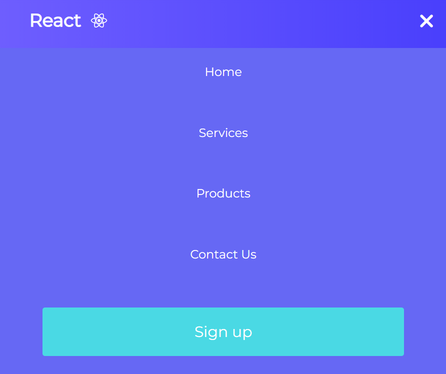

# React Navbar

> This project was simple react application with a designed navigation bar.

## Table of Contents
* [General Info](#general-information)
* [Technologies Used](#technologies-used)
* [Screenshots](#screenshots)
* [Setup](#setup)
* [Project Status](#project-status)
* [Acknowledgements](#acknowledgements)
* [Contact](#contact)

## General Information
- This project was a react application with a simple designed navigation bar I created while learning React.

## Technologies Used
- React - version 18.2.

## Screenshots
- Web Screenshot
  
    

- Web Screenshot on mobile
  
    

## Setup
To run this project, install it locally using npm:

```
$ cd ../react-navbar
$ npm install
$ npm start
```

## Project Status
Project is: _complete_ .

## Acknowledgements
- This project was inspired by Brian Design Youtuber.
- This project was based on [this tutorial](https://www.youtube.com/watch?v=fL8cFqhTHwA&t=3053s).


## Contact
Created by [@ToQuyenPhan](https://www.facebook.com/profile.php?id=100006321400254) - feel free to contact me!
